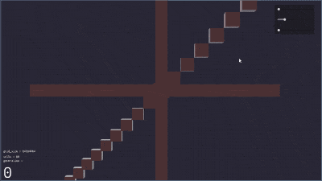

# Game of life - 3D

This is 3D implementation of Conway's Game of Life using the Godot Engine for the visualization and compute shaders for the simulation.

The project is very barebones and was meant to be a learning experience of Godot and compute shaders. It is not a finalized project and probably never will be.

## Controls
- `Left Mouse Drag` - Move the camera
- `Right Mouse Drag` - Zoom the camera
- `First slider` - Space out blocks
- `Second slider` - Simulation speed

